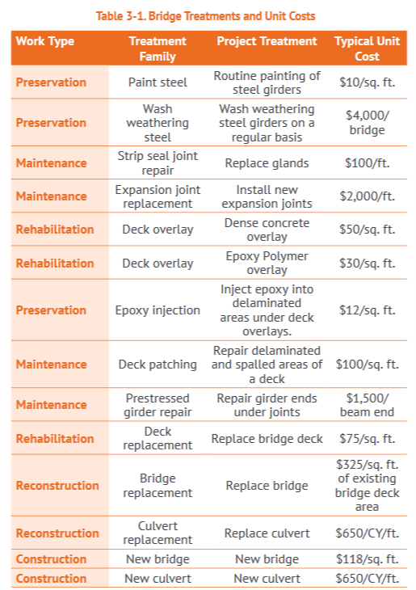
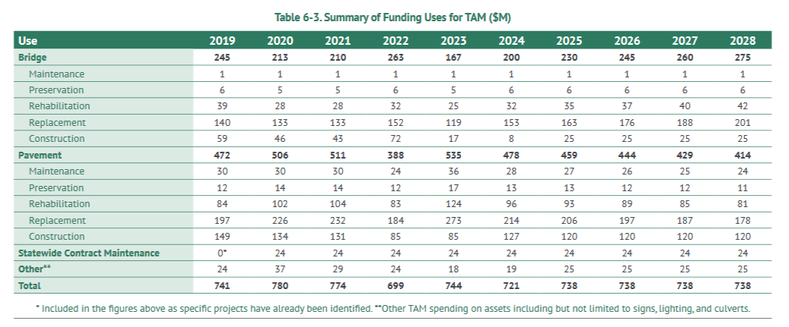
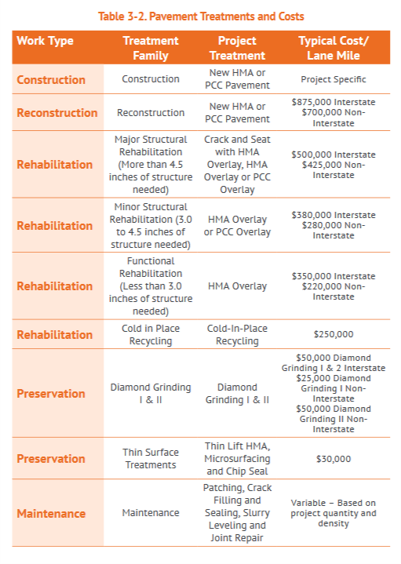

```{r setup, include=FALSE}
knitr::opts_chunk$set(echo = TRUE)
```

<font size="5"> **Introduction**  
<font size="3">  

The 5 Year program is prepared by the Iowa Department of Transportation (Iowa DOT) and identifies transportation projects planned for construction on a annual basis for a period of five years, in this case 2021-2025.  The program includes projects for aviation, transit, railroad, safety, trails and highway.  Project location, county, work type, route, length and annual construction costs are included in the program for each project listed.  The document is updated annually by removing completed projects, introducing new projects, revising project schedules and costs and rescheduling projects as needed.  It is approved by the Iowa DOT commission and provides transparency to the public by being available on the Iowa DOT's website. 

Information in the 5 Year Program can assist the Iowa DOT, local public agencies and the federal government in developing a budget, identifying needs, project status, documentation requirements and staffing resources.  The document also makes it easier for organizations to compare estimated project costs with actual project costs and track project costs/status over the years, across the state/county and by project.  There is a lot of information in the 5 Year Program, so we focused our analysis on the highway program, which begins on page 50.

<font size="5">**Dataset Overview**
<font size="3">

The 5 Year Program can be found on the Iowa DOT's website at:


<div align="center">https://iowadot.gov/program_management/FINAL_2021-2025_5YrProg.pdf</div><br>

The 5 Year Program was originally created as a pdf and exported to an excel spreadsheet.  The conversion was a bit messy so quality assurance (QA) was done to ensure that project costs were correct and in the correct year.  Several columns were added to the dataset including Iowa DOT District, county latitude and longitude and projects rescheduled in case the Highway Trust Funds becomes insolvent. We also *filled down* the project location and miles for each work type and renamed several columns.  As each of us explored the data, we continued to make various changes/revisions specific to our individual analysis.

```{r message=FALSE, echo = TRUE, results = "hide"}

library(readxl)
library(tidyverse)
library(dplyr)

FiveYear <- read_excel('./2021_2025_5YrProg_Highway_Program.xlsx')

str(FiveYear) 
names(FiveYear)

FiveYear <- FiveYear %>% 
  fill(Location, .direction = "down") %>% 
  rename(District = `Iowa DOT District`, Route = `Project Route`, 
         Work = `Type of Work`) %>%
  group_by(County, District, Route, Location) %>%
  fill(Miles, .direction = "down") %>%
  mutate(District = as.numeric(District))
  

```


## Allan Juarez

<font size="3"> 

* Type, number, route, and location by County and estimated costs of projects planned between 2021 – 2025.  Where is the money going and how much?

```{r }
states <- map_data('state')
us_counties <- map_data("county")

twentyone <- FiveYear %>% 
  select(County,'Latitude\r\n(Decimal(', "Longitude\r\n(Decimal)","2021") %>%
  rename(year ="2021")%>%
  mutate(subregion = tolower(County)) %>% 
  group_by(subregion) %>% 
  summarize(total = sum(year,na.rm=TRUE))

 
iowa <- c("iowa")
us_counties <- us_counties %>% filter(region %in% iowa)
twentyone <- inner_join(twentyone, us_counties, by = "subregion")
 twentyone %>% ggplot(data = twentyone,
            mapping = aes(x = long, y = lat,
                          group = group, fill = total))+ geom_polygon(color = "gray90", size = 0.1) 
 
 twentytwo <- FiveYear %>% 
  select(County,'Latitude\r\n(Decimal(', "Longitude\r\n(Decimal)","2022") %>%
  rename(year ="2022")%>%
  mutate(subregion = tolower(County)) %>% 
  group_by(subregion) %>% 
  summarize(total = sum(year,na.rm=TRUE))

 
iowa <- c("iowa")
us_counties <- us_counties %>% filter(region %in% iowa)
twentytwo <- inner_join(twentytwo, us_counties, by = "subregion")
 twentytwo %>% ggplot(data = twentytwo,
            mapping = aes(x = long, y = lat,
                          group = group, fill = total))+ geom_polygon(color = "gray90", size = 0.1)
 
twentythree <- FiveYear %>% 
  select(County,'Latitude\r\n(Decimal(', "Longitude\r\n(Decimal)","2023") %>%
  rename(year ="2023")%>%
  mutate(subregion = tolower(County)) %>% 
  group_by(subregion) %>% 
  summarize(total = sum(year,na.rm=TRUE))

 
iowa <- c("iowa")
us_counties <- us_counties %>% filter(region %in% iowa)
twentythree <- inner_join(twentythree, us_counties, by = "subregion")
 twentythree %>% ggplot(data = twentythree,
            mapping = aes(x = long, y = lat,
                          group = group, fill = total))+ geom_polygon(color = "gray90", size = 0.1) 
 
twentyfour <- FiveYear %>% 
  select(County,'Latitude\r\n(Decimal(', "Longitude\r\n(Decimal)","2024") %>%
  rename(year ="2024")%>%
  mutate(subregion = tolower(County)) %>% 
  group_by(subregion) %>% 
  summarize(total = sum(year,na.rm=TRUE))

 
iowa <- c("iowa")
us_counties <- us_counties %>% filter(region %in% iowa)
twentyfour <- inner_join(twentyfour, us_counties, by = "subregion")
 twentyfour %>% ggplot(data = twentyfour,
            mapping = aes(x = long, y = lat,
                          group = group, fill = total))+ geom_polygon(color = "gray90", size = 0.1)
 
 twentyfive <- FiveYear %>% 
  select(County,'Latitude\r\n(Decimal(', "Longitude\r\n(Decimal)","2025") %>%
  rename(year ="2025")%>%
  mutate(subregion = tolower(County)) %>% 
  group_by(subregion) %>% 
  summarize(total = sum(year,na.rm=TRUE))

 
iowa <- c("iowa")
us_counties <- us_counties %>% filter(region %in% iowa)
twentyfive <- inner_join(twentyfive, us_counties, by = "subregion")
 twentyfive %>% ggplot(data = twentyfive,
            mapping = aes(x = long, y = lat,
                          group = group, fill = total))+ geom_polygon(color = "gray90", size = 0.1)

```

## John King

<font size="3"> 

* What work types are associated with interchanges?  Costs? What routes are interchanges being proposed on?

```{r }

```

## Adam Brandt

<font size="3"> 

* Projects < $50 million, projects > $50 million & < $100 million, major projects > $100.  What is the most expensive project in each District?  The least expensive?
```{r }
projects <- FiveYear %>% 
  select(District, County, Route, 'Latitude\r\n(Decimal(', "Longitude\r\n(Decimal)", "2021", "2022", "2023", "2024", "2025") %>%
  mutate(subregion = tolower(County)) %>% 
  group_by(County, District, Route, Location) %>% 
  summarise(cost = sum(`2021`, `2022`, `2023`, `2024`, `2025`,  na.rm=TRUE))

max_projects <- projects %>% arrange(-cost)
head(max_projects)

min_projects <- projects %>% arrange(cost)
head(min_projects)

max_by_district <- projects %>% group_by(District) %>% slice(which.max(cost)) 
ggplot(data = max_by_district) + geom_bar(aes(x = District, y = cost), stat = 'identity') +
  labs(x = "Cost by District", y = "Cost in Thousands of Dollars", title = "Cost of Projects by District")
head(max_by_district)

min_by_district <-projects %>% group_by(District) %>% slice(which.min(cost))
ggplot(data = min_by_district) + geom_bar(aes(x = District, y = cost), stat = 'identity') +
  labs(x = "Cost by District", y = "Cost in Thousands of Dollars", title = "Cost of Projects by District")
head(min_by_district)

range <- split(projects, cut(projects$cost, c(0, 50000, 100000, 1000000)))
head(range)
hist(projects$cost, main = "Distribution of Project Costs", xlab = "Cost of Projects in Thousands of Dollars", ylab = "Number of Projects")
```
There are 629 projects that are less than $50 million, 6 projects that are between $50 and $100 million, and 4 projects that are more than $100 million. The costs are the total cost of the project over the five years. The cost column is in thousands of dollars. The most expensive project is the I-29/80/480 INTERSTATES IN COUNCIL BLUFFS (CBIS) at $319,603,000 and the least expensive project is 	1.8 MI W OF DES MOINES RIVER TO W OF SNEDDEN DR at $2000.

## Colin Willenborg(Project Coordinator)

<font size="3"> 

* Project types and costs between Iowa DOT Districts and years.

```{r}
head(FiveYear)
districts <- FiveYear %>% 
  select(County, District) %>% 
  mutate(subregion = tolower(County))

county_map <- map_data("county")
ia <- subset(county_map, region =="iowa")

districts_2021 <- FiveYear %>% 
  select(District, County,'Latitude\r\n(Decimal(', "Longitude\r\n(Decimal)","2021") %>%
  rename(year ="2021")%>%
  mutate(subregion = tolower(County)) %>% 
  group_by(District) %>% 
  summarize(total = sum(year,na.rm=TRUE))

districts_2021
districts_2021_totals <- districts_2021

ia <- inner_join(ia, districts, by="subregion")

districts_2021 <- inner_join(districts_2021, ia, by = "District")

districts_2021 %>% ggplot(aes(x = long, y = lat, fill=District)) + geom_polygon(aes(group=group,fill = total), color="gray60", size=0.1)

districts_2022 <- FiveYear %>% 
  select(District, County,'Latitude\r\n(Decimal(', "Longitude\r\n(Decimal)","2022") %>%
  rename(year ="2022")%>%
  mutate(subregion = tolower(County)) %>% 
  group_by(District) %>% 
  summarize(total = sum(year,na.rm=TRUE))

districts_2022
districts_2022_totals <- districts_2022

districts_2022 <- inner_join(districts_2022, ia, by = "District")

districts_2022 %>% ggplot(aes(x = long, y = lat, fill=District)) + geom_polygon(aes(group=group,fill = total), color="gray60", size=0.1)

# 2023
districts_2023 <- FiveYear %>% 
  select(District, County,'Latitude\r\n(Decimal(', "Longitude\r\n(Decimal)","2023") %>%
  rename(year ="2023")%>%
  mutate(subregion = tolower(County)) %>% 
  group_by(District) %>% 
  summarize(total = sum(year,na.rm=TRUE))

districts_2023
districts_2023_totals <- districts_2023

districts_2023 <- inner_join(districts_2023, ia, by = "District")

districts_2023 %>% ggplot(aes(x = long, y = lat, fill=District)) + geom_polygon(aes(group=group,fill = total), color="gray60", size=0.1)

# 2024
districts_2024 <- FiveYear %>% 
  select(District, County,'Latitude\r\n(Decimal(', "Longitude\r\n(Decimal)","2024") %>%
  rename(year ="2024")%>%
  mutate(subregion = tolower(County)) %>% 
  group_by(District) %>% 
  summarize(total = sum(year,na.rm=TRUE))

districts_2024
districts_2024_totals <- districts_2024

districts_2024 <- inner_join(districts_2024, ia, by = "District")

districts_2024 %>% ggplot(aes(x = long, y = lat, fill=District)) + geom_polygon(aes(group=group,fill = total), color="gray60", size=0.1)

# 2025
districts_2025 <- FiveYear %>% 
  select(District, County,'Latitude\r\n(Decimal(', "Longitude\r\n(Decimal)","2025") %>%
  rename(year ="2025")%>%
  mutate(subregion = tolower(County)) %>% 
  group_by(District) %>% 
  summarize(total = sum(year,na.rm=TRUE))

districts_2025
districts_2025_totals <- districts_2025

districts_2025 <- inner_join(districts_2025, ia, by = "District")

districts_2025 %>% ggplot(aes(x = long, y = lat, fill=District)) + geom_polygon(aes(group=group,fill = total), color="gray60", size=0.1)

```

```{r}
FiveYear_Pop <- left_join(FiveYear, IowaPop, by=c("County"="subregion")) %>% 
  rename(population = "2019") %>% 
  group_by(District) %>% 
  distinct(County, population) %>% 
  summarize(total_pop = sum(population, na.rm=TRUE))

districts_2021_totals <- left_join(districts_2021_totals, FiveYear_Pop)
districts_2021_totals %>% 
  mutate(spent_per_pop = (total* 1000) / total_pop)

districts_2022_totals <- left_join(districts_2022_totals, FiveYear_Pop)
districts_2022_totals %>% 
  mutate(spent_per_pop = (total* 1000) / total_pop)

districts_2023_totals <- left_join(districts_2023_totals, FiveYear_Pop)
districts_2023_totals %>% 
  mutate(spent_per_pop = (total* 1000) / total_pop)

districts_2024_totals <- left_join(districts_2024_totals, FiveYear_Pop)
districts_2024_totals %>% 
  mutate(spent_per_pop = (total* 1000) / total_pop)

districts_2025_totals <- left_join(districts_2025_totals, FiveYear_Pop)
districts_2025_totals %>% 
  mutate(spent_per_pop = (total* 1000) / total_pop)
```

## Lisa McDaniel

<font size="3"> 

So we've seen the impacts of the 5 Year Program at a state level but how can the program be used at a national level?

The code of federal regulation, 23 CFR 515,  requires states to develop an asset management plan that describes how they will manage the national highway system in a financially responsible manner.  There are a lot of requirements in developing the asset management plan, including how other planning documents, such as the 5 Year Program, contributes to managing their assets.  By law, the Iowa DOT only has to include bridge/culvert and pavement assets.  Implementation, which is based on expenditures, is reviewed on an annual basis.  There are penalties if states don't develop and implement an asset management plan according to federal law.

The analysis I performed focuses on how the Iowa DOT's 5 Year program contributes to managing their bridge and pavement assets and compares funding levels in the 5 Year Program to those in the asset management plan.

The Iowa DOT's asset management plan was approved last in 2019 and can be found on their website at:

<div align="center">https://iowadot.gov/systems_planning/fpmam/IowaDOT-TAMP-2019.pdf</div>
<div align="left">  

The following questions related to bridge and pavement asses, were explored to determine if there is a relationship between the 5 Year Program and the asset management plan:  

* How/do bridge/culvert and pavement work types in the 5 Year Program relate to the federal work types required by law in the asset management plan:  construction, replacement, reconstruction, maintenance or preservation?  

* How do funding levels in the 5 Year Program compare to those in the asset management plan?

* Compare the five year total of the 5 Year Program to the asset management plan.

<font size="5"> Bridge Assets  <font size="3">  
  
The 5 Year Program identifies specific projects/costs whereas the asset management plan identifies funding based on the federal work types of construction, replacement, reconstruction, maintenance or preservation.  To compare the 5 Year Program with the asset management plan I needed to sort the projects into the different federal work types.  

Table 3-1 in the asset management plan, shown below, provides a crosswalk between the Iowa DOT's bridge treatment or work as described in the 5 Year Program and the federal work types as defined by law.


<div align="center">  

<div align="left">  
Based on the information in the table above, I was able to sort the bridge/culvert projects in the 5 Year Program into the federal work types of construction, replacement, reconstruction, maintenance or preservation.  


```{r echo=FALSE}

Bridge <- FiveYear %>%
  select(District, County, Route, Location, Miles, Work, `2021`, `2022`, `2023`, `2024`, `2025`) %>%
  filter(grepl(c("BRIDGE|CULVERT"), Work)) %>%
  mutate(FedWork = str_replace_all(Work, c("BRIDGE PAINTING|BRIDGE CLEANING" = "Preservation",
                                           "CULVERT EXTENSION|CULVERT REPAIR" = "Maintenance",
                                      "BRIDGE DECK OVERLAY|BRIDGE REHABILITATION" = "Rehabilitation",
                            "BRIDGE REPLACEMENT|CULVERT REPLACEMENT|BRIDGE REMOVAL" = "Replacement",
                        "BRIDGE NEW|CULVERT NEW|PIPE CULVERTS|BRIDGE WIDENING" = "Construction")))
  
print.data.frame(head(Bridge))

```

Table 6-3 in the asset management plan, shown below, shows the bridge and pavement funding levels by federal work type for 2019 - 2025.

<div align="center">  

<div align="left">  

Using the information in the table above, I compared the funding levels in the 5 Year Program and asset management plan based on the federal work types.  Nothing really stands outs in this comparison; the strongest relationship between the two plans appears to be between the funding levels for rehabilitation and replacement. 

```{r message=FALSE, echo=FALSE, fig.height=8, fig.width=12}

Bri1 <- Bridge %>%
  group_by(FedWork) %>%
  summarise(`20215YrPlan` = sum(`2021`/1000, na.rm = TRUE),
            `20225YrPlan` = sum(`2022`/1000, na.rm = TRUE), 
            `20235YrPlan` = sum(`2023`/1000, na.rm = TRUE), 
            `20245YrPlan` = sum(`2024`/1000, na.rm = TRUE),
            `20255YrPlan` = sum(`2025`/1000, na.rm = TRUE)) %>%
  add_column(`2021Asset` = c(43, 1, 5, 28, 133),
             `2022Asset` = c(72, 1, 6, 32, 152),
             `2023Asset` = c(17, 1, 5, 25, 119),
             `2024Asset` = c(8, 1, 6, 32, 153),
             `2025Asset` = c(25, 1, 6, 35, 163)) %>%
  pivot_longer(`20215YrPlan`:`2025Asset`, names_to="Year", 
               values_to = "Cost") %>%
  mutate(Plan = str_replace_all(Year, c("20215YrPlan|20225YrPlan|20235YrPlan|20245YrPlan|20255YrPlan" = "5 Year",
                      "2021Asset|2022Asset|2023Asset|2024Asset|2025Asset" = "Asset Management"))) %>%
  mutate(Year2 = str_replace_all(Year, c("20215YrPlan|2021Asset" = "2021", "20225YrPlan|2022Asset" ="2022", 
                                "20235YrPlan|2023Asset" = "2023", "20245YrPlan|2024Asset" = "2024", 
                                        "20255YrPlan|2025Asset" = "2025"))) %>%
  select(-Year) %>%
  rename(Year = Year2) %>%
  mutate(Year = as.numeric(Year))


ggplot(Bri1, aes(Year, Cost, fill=Plan)) + 
  geom_bar(stat='identity', position = "dodge") + 
  ggtitle("Bridge Assets\n 5 Year Program vs Asset Management Plan") + 
  labs(y="Cost, $Millions", x="") +
  theme(axis.text.x = element_text(angle = 90, size = 10, vjust = 0.2, hjust = 1)) +
  theme(plot.title = element_text(hjust = 0.5)) +
  theme(axis.ticks.y=element_blank()) +
  theme(axis.text.y = element_blank()) +
  facet_wrap(~FedWork, scales = "free") +
  geom_text(aes(x=Year,y=Cost,label=paste("$",Cost)), 
            position = position_dodge(0.9), vjust=-0.5, hjust=0.6, size=2)
 
```

Projects/cost and funding levels can fluctuate, sometimes significantly, from year to year depending on need, so it may be hard to determine if there is any correspondence between the two plans on an annual basis, so I looked at cumulative funding levels for the work types over the five year period.

The figure below shows that there is indeed correspondence between the funding levels in the 5 Year Program and asset management plan.

```{r, message=FALSE, echo=FALSE, fig.height=8, fig.width=12, fig.align='center'}

Bri1a <- Bri1 %>%
  group_by(FedWork, Plan) %>%
  summarise(Cost = sum(Cost)) %>%
  mutate(Cost = round(Cost, 2))

ggplot(Bri1a, aes(FedWork, Cost, fill = Plan)) + 
  geom_bar(stat='identity', position="dodge") + 
  ggtitle("Bridge Assets\n Funding Levels Over the 5 Year Period") + 
  labs(x="", y="Cost, $Millions") +
  theme(axis.text.x = element_text(angle = 90, size = 10, vjust = 0.2, hjust = 1)) +
  theme(plot.title = element_text(hjust = 0.5)) + 
  theme(axis.ticks.y=element_blank()) +
  theme(axis.text.y = element_blank()) +
  geom_text(aes(x=FedWork,y=Cost,label=paste("$",Cost)), 
            position = position_dodge(0.9), vjust=-0.5, hjust=0.6)


```

The difference in total funding between the two plans, for bridge assets, is between 5 1/2 - 6% over the five year period.

```{r message=FALSE, echo=FALSE}

Bri1b <- Bri1a %>%
  group_by(Plan) %>%
  summarise(FiveYear = sum(Cost))
  
Bri1b

```

<font size="5"> Pavement Assets

<font size="3"> 

Table 3-2 in the Iowa DOT's asset management plan, shown below, provides a crosswalk between the pavement treatments, or work as described in the 5 Year Program, and the federal work types.

<div align="center">  

<div align="left">  

```{r }

```